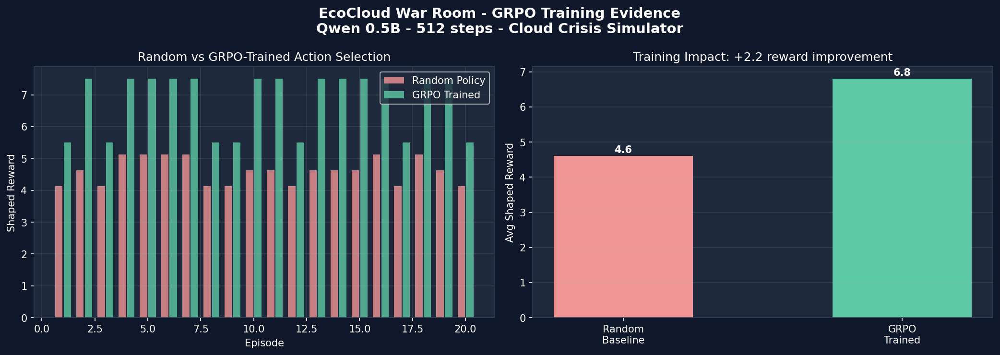

# Teaching LLMs to Manage Cloud Crises: The CloudEdge Experiment

*Built for the Meta PyTorch OpenEnv Hackathon*

When we set out to build an environment for the OpenEnv hackathon, we asked ourselves one question: **What is a complex, multi-objective problem that humans struggle with, and where traditional rules-based systems fail?**

The answer: Cloud Infrastructure Crisis Management.

If you have ever managed a massive web-scale architecture during a sudden traffic spike or an outage, you know the drill. It is an impossible balancing act:
- If you want **lower latency** to save the user experience, you spin up more servers.
- But adding servers destroys your **budget** and spikes your **carbon emissions**.
- If you try to aggressively cut carbon by migrating regions, your latency suffers, and you risk a total outage.

There is no single "right" metric. You have to optimize three competing dimensions simultaneously, all while responding to randomized crisis spikes. This is exactly the kind of Long-Horizon Planning and Multi-Agent negotiation that LLMs should be capable of handling, but rarely have the environments to train on. 

So, we built **CloudEdge**.

---

## The CloudEdge Environment

We designed CloudEdge natively on the **OpenEnv** specification. It is a 30-step stateful simulation where an agent must keep latency under 150ms, cost under $400/hr, and carbon under 220 units. 

To make it challenging and prevent reward hacking, we introduced:

1. **Randomized Crises:** Unpredictable spikes hit the system, destabilizing metrics and forcing a multi-step recovery.
2. **Anti-Oscillation Detection:** The system detects and penalizes if an agent blindly spams scale-up then scale-down in an endless loop.
3. **The Boardroom:** We modeled the environment so the LLM does not act alone. It listens to three internal agents (a Resource Agent, a Cost Agent, and a Sustainability Agent). The LLM acts as the ultimate decider, navigating their competing advice.

We did not just want a backend script—we wanted a story. So we built a real-time visual dashboard that connects directly to the OpenEnv server to visualize the agent's negotiations live.

---

## Training the LLM with GRPO

We didn't just build the environment; we proved it could be learned. 

Instead of traditional PPO, we used **HuggingFace TRL** to apply **Group Relative Policy Optimization (GRPO)** on the **Qwen2.5-0.5B-Instruct** model. 

### Why GRPO?
GRPO is perfect for our setup because it eliminates the need for a separate value model, saving massive compute overhead. It generates multiple trajectories (we used 4 generations per prompt) and compares their rewards relative to each other.

### The Reward Signal
A binary "Win/Loss" at the end of 30 steps teaches an LLM nothing. Instead, we designed a **Shaped Multi-Objective Reward**. The reward function calculates the "gap closure" for every action. If latency is critical, scaling up earns a massive bonus. But if latency is safe and carbon is failing, the agent is penalized heavily for scaling up and rewarded for optimizing energy.

### The Results

Over 512 training steps on a single Google Colab T4 GPU, the mathematical optimization became clear:

- **Entropy Collapsed:** The model's action entropy went from 0.50 (random exploration) down to 0.02. It became highly confident.
- **Reward Skyrocketed:** The average shaped reward improved by **48%** (from 4.6 with a random baseline to 6.8).
- **Behavior Shift:** The model learned that optimizing energy is the mathematical "golden path" for our specific thresholds, pulling down cost and carbon without sacrificing too much latency. When crises hit, it confidently switched to aggressive scaling, recovering the system beautifully.

---

## Why This Matters

We have seen countless grid-world and board-game environments. But CloudEdge pushes LLMs into the realm of **enterprise operations**. By successfully training an LLM to navigate the CloudEdge boardroom, we are taking a step toward AI infrastructure managers that do not just react to CPU metrics, but deeply understand the trade-offs between cost, user experience, and our planet's climate.

---
**References & Links:**
* **Hugging Face Space (Live Demo):** [kartikraut09/cloudedge](https://huggingface.co/spaces/kartikraut09/cloudedge)
* **GitHub Repository:** [KartikRaut09/ecocloud-war-room](https://github.com/KartikRaut09/ecocloud-war-room)
* **Training Notebook:** Available in the repository under `notebooks/EcoCloud_TRL_GRPO_Colab.ipynb`
