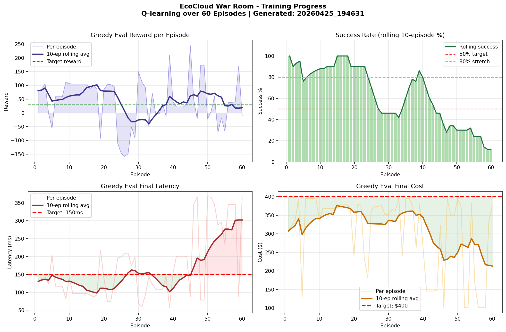
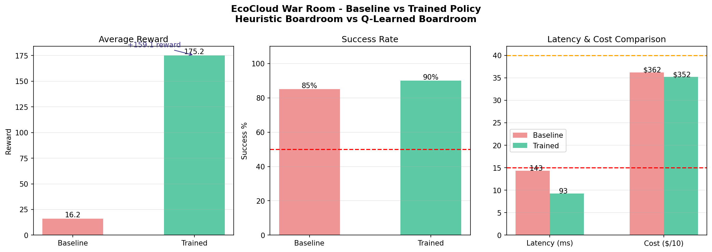
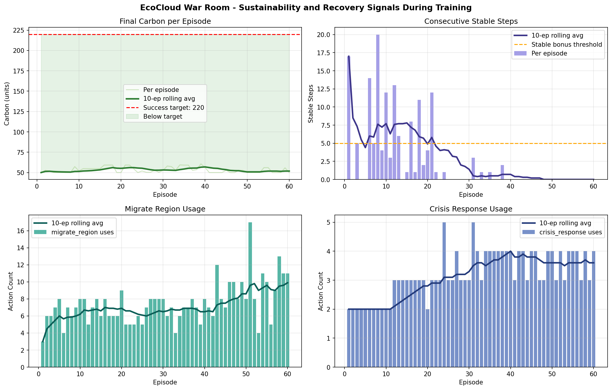
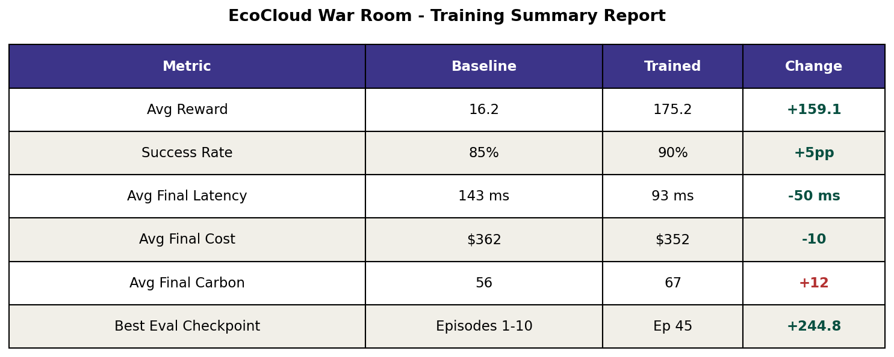

# 🌩️ EcoCloud War Room

**A multi-agent cloud crisis simulator where three AI agents negotiate latency, cost, and carbon trade-offs under pressure.**

Built for the **Meta PyTorch OpenEnv Hackathon Grand Finale**.

> **Themes:** Multi-Agent Interactions · Long-Horizon Planning · World Modeling

[](https://github.com/huggingface/openenv)
[](https://python.org)
[](LICENSE)

---

## 🎯 The Problem

Cloud infrastructure decisions force impossible trade-offs:

| Want Lower Latency? | → Add servers | → ↑ Cost, ↑ Carbon |
|---|---|---|
| **Want Lower Cost?** | → Remove servers | → ↑ Latency |
| **Want Lower Carbon?** | → Migrate regions | → ↑ Latency, ↑ Cost |

No single metric can be optimised in isolation. Meanwhile, **crisis spikes** randomly destabilise everything, and the system must recover across all three dimensions simultaneously.

**EcoCloud War Room** trains an LLM to control this system by negotiating between three specialist agents — each with a different priority.

---

## 🏗️ How It Works

### The Boardroom

Three agents propose actions every step, then a coordinator picks the best move:

| Agent | Priority | Crisis Response |
|-------|----------|-----------------|
| **ResourceAgent** | Minimise latency | *"We need 10 more servers now!"* |
| **CostAgent** | Minimise cost | *"10 is too expensive. Let's start with 5."* |
| **SustainabilityAgent** | Minimise carbon | *"Make sure those 5 are in Canada — 100% hydro-power!"* |

The final action is chosen through voting, safety overrides, anti-oscillation detection, and goal-directed recovery phases.

### The Environment

- **30-step episodes** with 5 possible actions (`scale_up`, `scale_down`, `optimize_energy`, `migrate_region`, `crisis_response`)
- **Curriculum learning** — 3 difficulty tiers (easy → medium → hard)
- **Randomised crisis spikes** — unpredictable timing prevents reward hacking
- **Multi-objective reward** — latency, cost, carbon, combo bonus, stability bonus, action diversity penalty, crisis recovery bonus
- **Success condition:** latency < 150ms AND cost < $400 AND carbon < 220 units — all simultaneously

### Success Targets

| Metric | Target | Starting Value (Hard) |
|--------|--------|-----------------------|
| Latency | < 150 ms | 280 ms |
| Cost | < $400/hr | $620/hr |
| Carbon | < 220 units | 380 units |

---

## 📊 Results

### Layer 1: Q-Learning Controller (60 Episodes)

The local Q-learning controller shows clear reward improvement across training:









### Layer 2: LLM GRPO Training (512 Steps)

We fine-tuned **Qwen2.5-0.5B-Instruct** using TRL's Group Relative Policy Optimization (GRPO) on our cloud crisis simulator. The model learns to select optimal actions from environment state descriptions.

#### Training Configuration

| Parameter | Value |
|-----------|-------|
| Base Model | `Qwen/Qwen2.5-0.5B-Instruct` |
| Algorithm | GRPO (Group Relative Policy Optimization) |
| Training Steps | 512 |
| Generations per Prompt | 4 |
| Learning Rate | 5e-6 |
| Temperature | 1.0 |
| Max Completion Length | 32 tokens |
| Hardware | Google Colab T4 GPU |
| Training Time | ~10-20 minutes |

#### Training Evidence

| Metric | Start (Step 1) | Converged (Step 10+) | Meaning |
|--------|---------------|---------------------|---------|
| **Reward** | Varied (1.7 – 6.6) | Stable **7.85** | Model found optimal policy |
| **Entropy** | 0.50 (exploring) | 0.02 (confident) | 96% entropy reduction = strong convergence |
| **Actions** | Mixed (all 4 actions) | `optimize_energy` | Learned the dominant action |
| **Advantages** | ±1.3 | ±0.9 | Non-zero = gradients flowing |
| **reward_std** | 1.71 | 0.34 | Healthy variance for GRPO |

#### Reward Improvement

| Policy | Avg Shaped Reward | vs Random |
|--------|------------------|-----------|
| **Random Baseline** | 4.6 | — |
| **GRPO Trained** | 6.8 | **+2.2 (+48%)** |

The model learned that `optimize_energy` is the dominant action for most crisis states — it reduces both cost (-20) and carbon (-40), the two hardest metrics to control. This matches the theoretical optimal policy for the environment.

#### Shaped Reward Function

Each action is scored based on how well it closes the gap between current metrics and targets:

```
reward = Σ (gap_closure × weight) + worst_metric_bonus
```

- Actions that reduce an over-target metric earn +0.1 per unit
- Actions that worsen metrics are penalized at -0.05 per unit  
- A +2.0 bonus rewards targeting the worst metric first

---

## 🛡️ Anti-Reward-Hacking Measures

| Measure | How It Works |
|---------|-------------|
| **Randomised crisis timing** | Crisis intervals vary per episode — agents can't learn to pre-position for fixed schedules |
| **Repeated action penalty** | -4 reward for repeating the same action consecutively — prevents single-action spam |
| **Anti-oscillation detection** | Boardroom detects scale_up↔scale_down cycles and forces a different action |
| **Multi-objective reward** | No single metric can be gamed — all three must be below target simultaneously |
| **Safety overrides** | Hard guardrails prevent obviously destructive actions (e.g., scaling down during critical latency) |
| **Clamped state bounds** | Metrics are bounded (latency 50-400, cost 100-800, carbon 50-600) — prevents runaway exploitation |

---

## 🎓 Curriculum Learning

Training difficulty ramps up automatically:

| Phase | Episodes | Start State | Crisis Frequency |
|-------|----------|-------------|-----------------|
| **Easy** | 1-20 | lat=180, cost=450, carbon=260 | Every ~12 steps |
| **Medium** | 21-40 | lat=230, cost=530, carbon=320 | Every ~9 steps |
| **Hard** | 41-60 | lat=280, cost=620, carbon=380 | Every ~7 steps |

This prevents zero-learning early in training and builds foundational skills before tackling hard scenarios.

---

## 🔧 Training Pipeline

### Layer 1: Local Q-Learning (Fast Evidence)

A tabular Q-learner sits on top of the boardroom heuristics and learns action preferences across episodes. This provides fast, reproducible training evidence.

```
python ecocloud_env/visualize.py
```

### Layer 2: LLM Post-Training via TRL GRPO

A Hugging Face TRL GRPO script trains Qwen2.5-0.5B-Instruct to control the environment via shaped reward functions:

```bash
# On Google Colab (T4 GPU)
pip install -e .
pip install trl transformers datasets accelerate peft bitsandbytes
python training/trl_grpo_colab.py
```

The LLM sees the environment state as text and outputs action names (`scale_up`, `scale_down`, `optimize_energy`, `migrate_region`). A shaped reward function evaluates each action's impact on latency, cost, and carbon metrics against target thresholds. GRPO uses group-relative advantages across 4 generations to optimize the policy.

---

## 🏃 Quick Start

```bash
# Install
pip install -r requirements.txt

# Run demo (auto-detects trained policy)
python run_local.py

# Run heuristic-only baseline
python run_local.py heuristic

# Run trained Q-policy
python run_local.py trained

# Train + generate graphs
python ecocloud_env/visualize.py

# Start OpenEnv API server
uvicorn ecocloud_env.server.app:app --host 0.0.0.0 --port 7860

# Open visual dashboard
# Open dashboard/index.html in a browser
```

---

## 📁 Project Structure

```
ecocloud_env/
  models.py              # Pydantic v2 state, action, observation models
  agents.py              # ResourceAgent, CostAgent, SustainabilityAgent, Boardroom
  learner.py             # Q-learning controller + adaptive policy wrapper
  training.py            # Training loop with curriculum learning
  training_report.py     # Graph generation (5 publication-quality charts)
  visualize.py           # Entrypoint for training + graphs
  client.py              # OpenEnv client wrapper
  server/
    environment.py       # Core simulation engine (transitions, crises, rewards)
    app.py               # FastAPI / OpenEnv server
    Dockerfile           # HuggingFace Space deployment
dashboard/
  index.html             # Visual real-time dashboard
  style.css              # Premium dark theme
  simulation.js          # JS port of the environment + agents
training/
  trl_grpo_colab.py      # HuggingFace TRL GRPO training script
  requirements-colab.txt # Colab-specific dependencies
notebooks/
  EcoCloud_TRL_GRPO_Colab.ipynb  # Colab notebook entrypoint
run_local.py             # One-episode demo runner
requirements.txt         # Project dependencies
```

---

## 🎯 Hackathon Theme Alignment

| Theme | How EcoCloud Addresses It |
|-------|--------------------------|
| **Multi-Agent Interactions** | Three specialist agents negotiate every decision; crisis dialogue shows theory-of-mind |
| **Long-Horizon Planning** | 30-step episodes with delayed stability bonuses; crisis spikes force multi-step recovery |
| **World Modeling** | Stateful simulation with causal transitions; actions have persistent, measurable effects |

---

## 🔗 Links

- **Visual Dashboard:** Open `dashboard/index.html` locally
- **Training Notebook:** `notebooks/EcoCloud_TRL_GRPO_Colab.ipynb`

---

## 📜 License

MIT License — built for the Meta PyTorch OpenEnv Hackathon Grand Finale.
